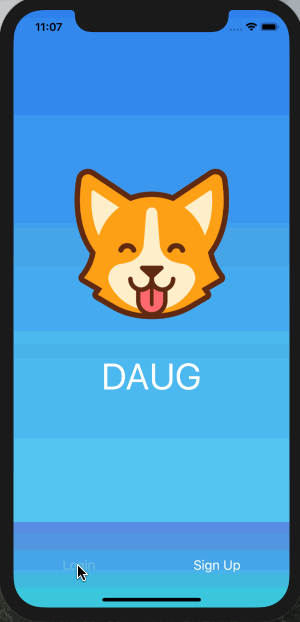

# Daug mobile app

This repo is the mobile app for Daug. It was built as part of the [MobileSpace](http://mobilespace.xyz/) [Season 2](https://github.com/mobilespace/Season2#season-2---looking-ahead) course by [Monte Thakkar](https://github.com/monte9/).

## What's Daug?

**Daug is a social network for pets.**

- Your pets can **sign up or login** using their paws.
- They can **upload selfies** or **post their thoughts** for other pets to see.
- They can also look at **other pets posts** and either **paw** (like) or **scratch** (dislike) it.

### [Demo - Try it on Expo](https://expo.io/@niszeto/daug-mobile)

## Getting started

```
git clone git@github.com:niszeto/daug-mobile.git

exp start

exp ios
```

## Designs

Intro, Login & Sign Up screens are based on **Robinhood App**.

Profile screen is based on **Instagram**.

Social Feed screen is based on **Facebook**.


## Assignment #1

### Objectives

- Learn how to build & organize screens in RN
- Learn advanced RN styling and use LinearGradient, Image, Icons & Custom Fonts
- Learn how to use mock data for prototyping UI screens
- Learn how to use NPM libaries such as React Native Elements, Expo & React Native Vector Icons

### TODO

- [x] Design & build an Intro Screen
  - [ ] :star: **Bonus:** Add [Snap Carousel](https://github.com/archriss/react-native-snap-carousel) with [Lottie animations](https://docs.expo.io/versions/latest/sdk/lottie.html) to Intro Screen
- [x] Design & build a Signup Screen
  - [ ] :star: **Bonus:** Add buttons to sign up with Facebook & Twitter
- [x] Design & build a Login Screen
  - [ ] :star: **Bonus:** Add buttons to login with Facebook & Twitter
- [x] Design & build a Profile Screen
  - [x] :star: **Bonus:** Add the Logout button
- [x] Design & build a Social Feed Screen with [Mock Data](https://raw.githubusercontent.com/mobilespace/daug-mobile/c4d4a331564ee490e1162f3733f3023afe3defc3/app/utils/constants.js)
- [x] Attach screenshots/gif of screens to `README.MD`

Demo

